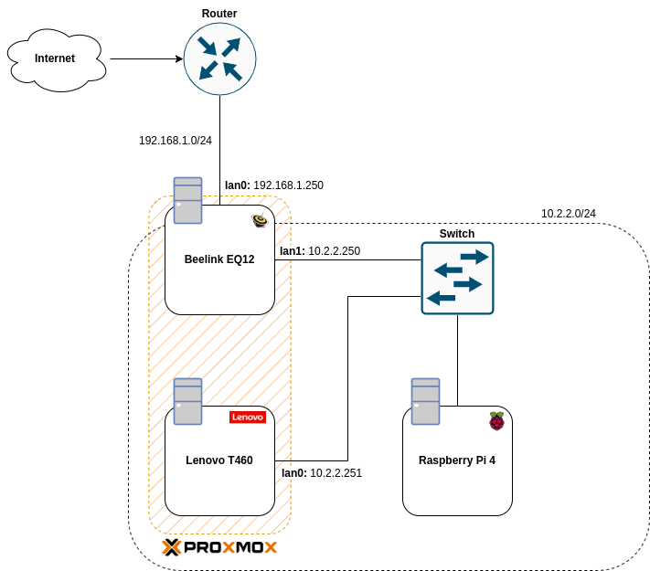

# Homelab
- Currently, I'm building my own HomeLab, it will be a small homelab due to my budget, however, one day I hope it grows.

# Requirements
- Have a Proxmox cluster with my Beelink EQ12 and my old Laptop Lenovo T460, however this will be turned off, most of the time.
- Have a K3S cluster, where a virtual machine inside of Beelink EQ12 will be the k3s controller and the Raspberry Pi will be a node, and I might add a virtualized node in my Beelink EQ12.
- Have a Firewall that is reponsible to monitorize the traffic and block unknown sources. I will use pfSense has my firewall.
- Have a VPN acess point that will be behind the firewall and only some MAC addresses will be allowed to access to the homelab.
- Have a secondary DNS server so I don't need to memorize all the IPs from my Network, which is a pain.
- Have a dashboard so I have an interactive way to be redirected to the Services. Besides in my browser tab, I will need only one bookmark.
- Have a Storage Server for my Proxmox, K3S and other services.
---
## Hardware
- Beelink EQ12
    - CPU: Intel N100
    - RAM: 16 GB
    - 2 Ethernet ports
- Raspberry Pi 4
    - RAM: 4 GB
- Lenovo T460
    - CPU: ?
    - RAM: 8 GB

## Network
- For my setup, I need to revise my requirements. Has my first setup, I think this design will do.

